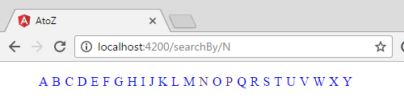

# AtoZ

A simple Angular 2 component to generate A to Z links to used on an Angular2 project.

This project was generated with [angular-cli](https://github.com/angular/angular-cli) version 1.0.0-beta.20-4.

## Build

Run `ng build` to build the project. The build artifacts will be stored in the `dist/` directory. Use the `-prod` flag for a production build.
